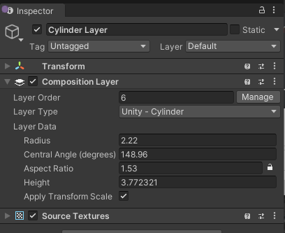

# Composition Layer component

Add a Composition Layer component to a GameObject to add a layer to a scene. See [Adding a composition layer].

You can set the basic properties of a layer in the inspector for the component. You can also specify additional information for rendering the layer using Composition Layer Extension components.

 *The CompositionLayer component Inspector*

| Property:| Function: |
|:---|:---|
| Layer Order| Sets the desired position of a layer in the composition order. Layers are typically composited with lower order values in back and higher order values in front, but composition layer implementations might choose a different algorithm.  The Default Scene Layer, which is an Projection Layer to which the Unity Scene is drawn, is always at order 0. Negative numbers should be composited behind the default layer. Positive values should be composited in front.  The Inspector prevents you from assigning the same order value to more than one layer. However, if you change layer properties at runtime, two layers could end up with the same order. In this case, the layer that was enabled first should be composited first.  |
| Layer Type| The type of layer. Changing this value changes the layer to a different type, which might have different properties and suggested extensions.  The base types include:<ul><li>Cylinder</li><li>Quad</li><li>Equirect</li><li>Projection</li><li>Cube</li></ul> Composition layer implementations might add their own types. |
| Manage button| Click the Manage button to open the Layer Order window. You can use this window to set the order of all layers in a scene. |

## Effect of the GameObject Transform

How the GameObject Transform affects the final rendering of a layer depends on both the layer type and the device implementation. The following table describes how the Transform properties are expected to apply to the basic Unity-defined layer types:

| Layer Type:                           | Position:                                                                     | Rotation:                                                                                                                        | Scale:                                                                                   |
|:--------------------------------------|:------------------------------------------------------------------------------|:---------------------------------------------------------------------------------------------------------------------------------|:-----------------------------------------------------------------------------------------|
| Projection/Projection Eye Rig | Ignored                                                                       | The center of the rendered texture is intersected by a line extending from the camera along the Forward vector of the Transform. | Ignored                                                                                  |
| Cylinder                      | Places the midpoint of the cylinder axis in the Unity scene.                  | Orients the cylinder  in the scene.                                                                                              | Changes the apparent size of the cylinder in the scene.                                  |
| Quad                          | Places the center of the quad in the Unity scene.                             | Orients the quad  in the scene.                                                                                                  | Changes the apparent size of the quad in the scene. The z-component of scale is ignored. |
| Equirect                      | Places the midpoint of the equirect sphere in the Unity scene.                | Orients the equirect in the scene.                                                                                               | Ignored                                                                                  |
| Cube               | Ignored. The center of the cube is always the user's head position in scene.  | Orients the rendered cube.                                                                                                       | Ignored.                                                                                 |

[Composition Layer component]: xref:xr-layers-base-component
[Color Bias and Scale extension]: xref:xr-layers-color-bias-scale
[Source Textures extension]: xref:xr-layers-source-textures
[Adding a composition layer]: xref:xr-layers-add-layer
[Adding a composition layer extension]: xref:xr-layers-add-extensions
