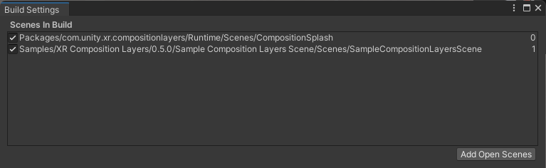

# Composition Layer Splash Screen
Composition Layers supports replacing the default Unity splash screen with a custom splash screen that is rendered using Composition Layers. Using Composition Layers for the Splash screen has some useful benefits, such as improved clarity and sharpness, and much more control over the splash screen appearance (e.g., using a Cylinder Layer, Locking to the horizon, etc.).

To use the Splash Screen provided by Composition Layers, you must disable the default Unity Splash Screen in the Player Settings. This can be done by navigating to `Edit > Project Settings > Player > Splash Image` and unchecking the `Show Unity Splash Screen` and setting `Virtual Reality Splash Image` to `None`.

> [!IMPORTANT]
> When enabling the Composition Layer Splash Screen, a new scene named "CompositionSplash" will automatically be added to the build settings. This scene is used to display the splash screen, and should not be modified directly. If you need to modify the splash screen, you can do so by modifying the settings in the Composition Layer Splash Screen settings. This scene will automatically be removed from the build settings when the Composition Layer Splash Screen is disabled.

## Splash Screen Settings
To access the Composition Layer Splash Screen settings, navigate to `Assets/CompositionLayers/UserSettings/Resources/CompositionLayersRuntimeSettings.asset`.

**Composition Layer Splash Settings**

| Setting:| Default Value:| Description:|
|:---|:---|
|**Enable Splash Screen**|`False`|If enabled, the splash screen is displayed when the application starts.|

**Style Settings**

|Setting:|Default Value:|Description:|
|:---|:---|:---|
|**Splash Screen Texture**|`Editor/Textures/Logo_MadeWithUnity.png`|The texture to display as the splash screen.|
|**Background Color**|`#231F20`|The color to display behind the splash screen texture.|

**Duration Settings**

|Setting:|Default Value:|Description:|
|:---|:---|:---|
|**Splash Duration**|`3.0`|The duration in seconds to display the splash screen (not including fade in and fade out time).|
|**Fade In Duration**|`2.0`|The duration in seconds to fade in the splash screen.|
|**Fade Out Duration**|`1.0`|The duration in seconds to fade out the splash screen.|

**Follow Settings**

|Setting:|Default Value:|Description:|
|:---|:---|:---|
|**Follow Speed**|`2.0`|The lerp speed at which the splash screen follows the camera.|
|**Follow Distance**|`2.0`|The distance from the camera at which the splash screen is displayed.|
|**Lock To Horizon**|`True`|If enabled, the splash screen is locked to the horizon.|

**Layer Settings**

|Setting:|Default Value:|Description:|
|:---|:---|:---|
|**Layer Type**|`Quad`|The type of Composition Layer to use for the splash screen. You can use a [Quad](overview.md) or a [Cylinder](overview.md) layer.|
